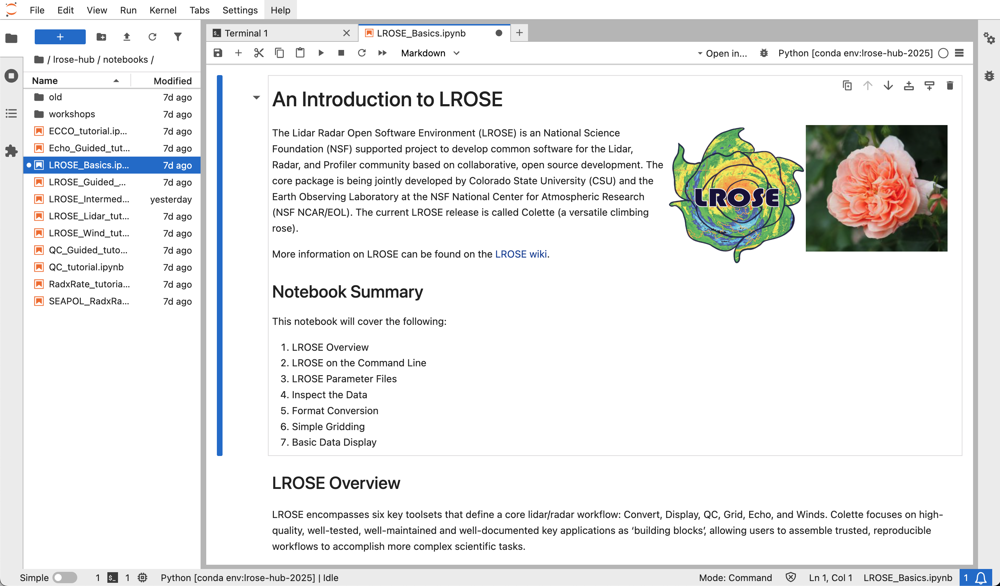

# Introduction

As weather radar and lidar processing tools mature and expand, maintaining software accessbility and educating users are critical to reproducible workflows and proper software use. One open source software package is the Lidar Radar Open Software Environment (LROSE), a joint project between Colorado State University and the NSF National Center for Atmospheric Research (NCAR) Earth Observing Laboratory (EOL), funded by two successive NSF grants beginning in 2016. Workshops and classroom exercises are common ways to educate various segments of the weather radar and lidar community. To improve accessbility, the LROSE Science Gateway was developed. The LROSE Science Gateway consists of requestable JupyterHub servers deployed on NSF's Jetstream2 supercomputer at Indiana University. The gateway supports all stages of a workflow, including command line tools, text editing, and visualization. The JupyterHub environment also supports integration of LROSE tools with other open source packages. 

## LROSE Background

The goal of LROSE is to develop common software for the weather lidar, radar, and profile community.  LROSE development is based on collaborative, open source principles, with algorithms developed and supported by the community. From data acquisition to scientific displays and analysis, LROSE encompasses over 400 applications across radar and lidar workflows. These applications cover a wide range of algorithms, and are typically grouped into six categories: data conversion, quality control, visualization, gridding, echo (i.e., analyzing aspects of the signal excluding the Doppler velocity), and wind (i.e., analyzing the Doppler velocity of the signal). The latest stable released is called "Colette" {cite}`dehart_2025_14624762`. LROSE applications have been used to study the dynamics of severe storms in Spain {cite}`delMoral2020`, to perform multi-Doppler analysis around complex terrain {cite}`Cha2023`, to study the microphysical properties in tropical cyclones {cite}`DeHart2020`, {cite}`Feng2019`, and to characterize cloud properties in different climates {cite}`Romatschke2023`.

LROSE applications are powerful, but complex. Each application runs using a combination of command line flags and parameter files. These parameters set everything from data input and output to customizations of the scientific algorithms, including any needed methods and coefficients. As a result, community education is critical to ensure proper, reproducible use of the software. To that end, the LROSE team hosts a variety of workshops to educate the community on how to use the applications and how parameter choices affect the resulting analysis. But installation and managing different versions of LROSE can waste precious time. To support efficient use of workshop time, the LROSE team requires the following: quick and easy access to consistent software, data, and educational materials, resources to support computationally-expensive applications, terminal-like functionality, text-editing capabilities, and data visualization (e.g., Python, LROSE GUI support).

## The LROSE Science Gateway

Based on the aforemention needs, the LROSE team developed the LROSE Science Gateway. A Science Gateway is a web-based resource to access data, software, and computing services (****citation needed here?****). Two different platforms were tested: a specialized GUI through a consultation with the Science Gateways Community Institute {cite}`SGCI` and a JupyterHub server through a partnership with the Unidata Science Gateway {cite}`chastang2017unidata`. Ultimately, the JupyterHub server as a Science Gateway platform {cite}`zonca2018jupyter` was chosen. This decision was made in part due to less development required from software engineers. Jupyter notebooks are widely used by the atmospheric science community, meaning tutorials can be developed by LROSE science team members and members of the community. Additionally, JupyterHub servers fit the needs of the LROSE community: LROSE applications can be run either as shell commands in notebook cells or on a terminal, parameter text files can be edited directly, and Python packages can manipulate and visualize output. A JupyterHub server can also integrate  LROSE tools with other open source software packages, including the Python ARM Radar Toolkit (Py-ART) {cite}`helmus2016pyart`. The JupyterHub server is hosted on NSF's Jetstream2 supercomputer at Indiana University, provided through an ACCESS allocation {cite}`boerner2023access`. Based on the successful partnership with NSF Unidata using the JupyterHub server, the LROSE team formalized a partnership with NSF Unidata engineers to deploy and improve the JupyterHub servers.

