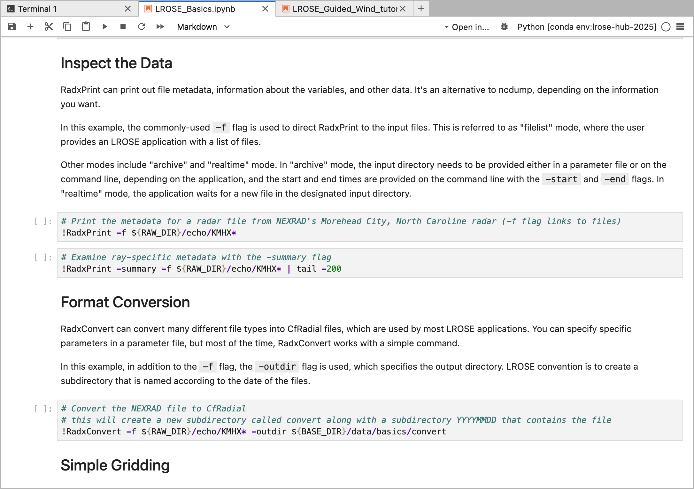
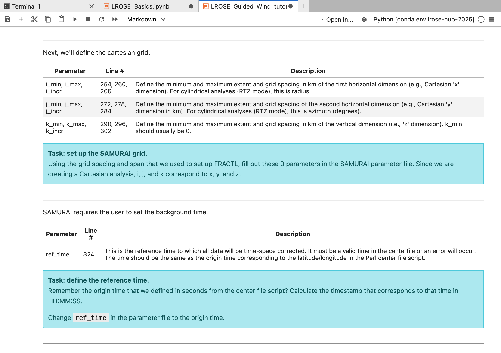

# LROSE Science Gateway Capabilities

With the necessary backend infrastructure deployed, the LROSE Science Gateway now supports a wide range of tutorials. Tutorial topics include: LROSE Basics, radar echo analysis, quality control, convective stratiform partitioning using ECCO [@Dixon2022], and dual-Doppler analysis. Some tutorials contain all necessary commands, parameters, and plotting (Fig. ####). These tutorials work best for demonstrating the initial capabilities of LROSE tools and the output users can expect. However, in workshop settings, the LROSE team found that using only these tutorials did not help the users learn how to use the appliations. Thus, so-called "guided" tutorials were developed, inspired by NSF Unidata Metpy tutorials, where users work through defined tasks to investigate the data and set up LROSE parameter files prior to running the applications (Fig. ####). These tutorials help users better understand how to work with data and set up LROSE workflows. We continue to refine our tutorials to meet time constraints and improve the user experience.

The LROSE Science Gateway has so far supported LROSE workshops at American Meteorological Society Annual Meetings and a pilot classroom exercise in a radar meteorology class at Colorado State University. The gateway will support an upcoming intermediate SAMURAI tutorial focused on how changing critical parameters affects the resulting analysis. Now that the gateway is stable, we plan to host more classroom exercises and short duration workshops.

